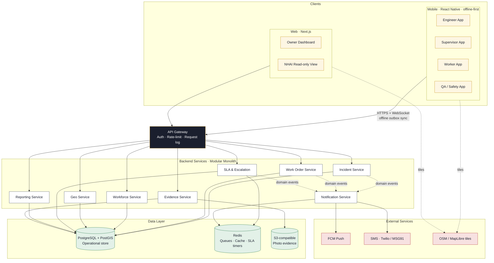

# Highway Operations Command (HOC)

> A GIS-enabled, mobile-first field operations platform for highway maintenance contracts.

**Document type:** Project brief & solution blueprint
**Audience:** Business owner, operations leadership, technology partners
**Status:** Pre-build — operational model and architecture definition
**Version:** 1.0 — 2026-05-24

---

## 1. Executive Summary

Highway Operations Command (HOC) is a digital operations platform purpose-built for organisations that hold **highway maintenance contracts** with national or state highway authorities (e.g. NHAI). It replaces today's WhatsApp-and-phone-call coordination with a structured, auditable, geographically-aware system of record for every incident, work order, and field action across the 200 km of highway under contract.

HOC is **not** a generic project-management tool. It is closer in spirit to a **field service dispatch platform** combined with an **infrastructure asset register** and a **GIS workflow engine**. The system's centre of gravity is the physical highway itself — every event, every photo, every signature is anchored to a chainage point on the road and to the engineer responsible for that stretch.

### What the system does

- Captures every maintenance incident — pothole, drain blockage, damaged barrier, fallen signboard, waterlogging — with **GPS coordinates, photo evidence, and timestamp**.
- Converts incidents into **work orders**, assigns them to the right engineer based on the 50 km stretch they own, and mobilises supervisors, workers, materials, and equipment.
- Tracks execution **in the field, on a phone**, with offline capability so connectivity gaps on remote stretches don't break the workflow.
- Verifies completion with **before / during / after photo evidence**, GPS-stamped, and a QA/Safety sign-off.
- Surfaces **SLA breaches, escalations, and engineer performance** to the owner and to NHAI through a dashboard and exportable reports.

### Why it matters

| Today | With HOC |
|---|---|
| Work tracked in notebooks & WhatsApp | Single system of record |
| No proof of completion | GPS + photo + timestamp evidence |
| SLA compliance is anecdotal | SLA clock per work order, breach alerts |
| Engineer productivity is unmeasurable | Per-engineer dashboards by km, by category |
| Audit response takes days | Audit trail is one query away |
| Escalations get lost in chat | Structured escalation ladder with timers |

---

## 2. Business Context

### 2.1 The operation

The business holds a maintenance contract for approximately **200 km of national highway** in India. The highway is divided into stretches of roughly **50 km** each, with one **Zone Engineer** accountable per stretch. The contract obliges the business to keep the highway safe, drivable, and aesthetically maintained — and to respond to incidents within agreed SLAs.

### 2.2 The work

Highway maintenance is **dynamic and event-driven**. Unlike a construction project with a fixed scope, every day brings a different mix of work generated by weather, traffic, accidents, and natural deterioration. Typical work categories:

| Category | Trigger | Typical SLA |
|---|---|---|
| Pothole repair | Inspection or public complaint | 24–72 hrs |
| Shoulder repair | Inspection, monsoon damage | 5–7 days |
| Drain cleaning | Pre-monsoon, post-rainfall | Scheduled cycle |
| Tree / shrub cutting | Visibility issue, growth cycle | 7 days |
| Signboard installation / repair | Damage, missing sign | 48 hrs |
| Road safety marker (delineators, cats-eyes) | Inspection, accident | 48–72 hrs |
| Median cleaning | Scheduled cycle | Weekly |
| Emergency incident response | Accident, fallen tree, oil spill | < 1 hr arrival |
| Barrier (W-beam / crash barrier) repair | Accident, inspection | 48 hrs |
| Waterlogging removal | Rainfall event | < 4 hrs |
| Reflector maintenance | Inspection cycle | Monthly |

### 2.3 The operating problems HOC solves

1. **No single source of truth.** Work lives in WhatsApp groups, paper logs, and engineer memory. When a question is asked ("was that pothole near km 142 fixed?"), nobody can answer with confidence.
2. **No proof of work.** When NHAI asks for evidence of completion, the team scrambles to find photos.
3. **No SLA visibility.** Breaches are discovered only when the authority complains.
4. **No productivity measurement.** It is impossible to know whether Engineer A is genuinely more productive than Engineer B, or just better at communicating.
5. **No structured escalation.** A stuck work order has no defined path upward — it festers until it becomes a crisis.
6. **No audit trail.** The contract is auditable; the operation is not.

---

## 3. The Operational Model

This is the most important section of the document. The technology only works if the operational model is right.

### 3.1 Roles & responsibilities

| Role | Span of control | Primary responsibility | Primary channel |
|---|---|---|---|
| **Owner / Contract Manager** | Whole contract (200 km) | Overall accountability, NHAI interface, financial outcomes | Web dashboard |
| **Zone Engineer** | ~50 km stretch | Plan, allocate, and close all work in their zone; SLA owner | Mobile app + web |
| **Supervisor** | One or more crews | Mobilise workers, materials, equipment; on-site execution lead | Mobile app |
| **Field Worker** | A single task | Execute the physical work; capture evidence | Mobile app (simple UI) |
| **QA / Safety Officer** | Cross-zone | Verify completion quality, audit safety compliance | Mobile app + web |
| **Contractor** | Sub-contracted work | Provide manpower, equipment, or specialised work | Mobile app (limited) |
| **Authority / NHAI** | External oversight | Receive reports, raise complaints, audit | Reports / portal view |

### 3.2 The core concept

Every feature, every screen, every database table must serve this single flow:

```
Highway Segment  →  Incident  →  Work Order  →  Workforce Mobilisation  →  Evidence  →  Closure
       │              │              │                   │                     │           │
   geo-anchor    what is wrong   what to do        who is doing it       proof of work   sign-off
```

If a proposed feature does not advance one of these six steps, it does not belong in v1.

### 3.3 Operational cycles

HOC runs on four overlapping cycles:

1. **Daily cycle** — Morning briefing → patrol & inspection → incident logging → work order dispatch → execution → end-of-day closure & evidence review.
2. **Weekly cycle** — Engineer review with owner, SLA scorecard, backlog grooming, materials re-order, contractor performance review.
3. **Emergency cycle** — Accident / waterlogging / fallen tree → immediate dispatch (no work-order paperwork up-front) → on-site action → retrospective documentation.
4. **Reporting cycle** — Monthly NHAI report compiled directly from the system, with photo evidence packs and SLA performance.

---

## 4. Operational Workflows (Detailed)

For each of the ten workflows below the structure is: **Trigger → Role → Inputs → Outputs → SLA → Failure modes.**

### 4.1 Incident identification

- **Trigger:** Daily patrol observation, public complaint, NHAI notification, CCTV / camera alert, or scheduled inspection.
- **Role:** Zone Engineer or Supervisor (most common); occasionally Owner forwarding a complaint.
- **Inputs:** GPS location (auto-captured), chainage (km marker), photo, free-text description, category tag, severity.
- **Outputs:** An **Incident** record with a unique ID, geo-tagged and time-stamped.
- **SLA:** Incident must be logged within 30 minutes of identification.
- **Failure modes:** No mobile signal → offline capture, sync later. Wrong chainage → snap-to-segment using the highway centreline. Duplicate report → de-duplication by proximity + category.

### 4.2 Work order creation

- **Trigger:** An Incident is triaged.
- **Role:** Zone Engineer.
- **Inputs:** The Incident, work category, estimated effort, estimated materials, target completion date, assigned supervisor.
- **Outputs:** A **Work Order** linked to the Incident, with an SLA clock started.
- **SLA:** Work order opened within 4 hours of incident creation for routine; immediately for emergency.
- **Failure modes:** Engineer overloaded → workload visible to Owner who can re-balance. Missing materials → flagged before mobilisation.

### 4.3 Engineer assignment & workforce mobilisation

- **Trigger:** Work order is open.
- **Role:** Zone Engineer assigns; Supervisor mobilises.
- **Inputs:** Work order, available crew, available equipment, available materials, traffic conditions.
- **Outputs:** A **Mobilisation** record: who is going, with what, when, ETA on site.
- **SLA:** Crew on-site within window defined by work category SLA.
- **Failure modes:** Crew diverted to emergency → work order re-scheduled with reason. No equipment → escalation to Owner.

### 4.4 Material & equipment allocation

- **Trigger:** Mobilisation planning.
- **Role:** Supervisor, validated by Engineer.
- **Inputs:** Material stock levels, equipment availability roster.
- **Outputs:** A **Material Issue** record (what left the stockyard) and an **Equipment Booking**.
- **SLA:** Before crew dispatch.
- **Failure modes:** Stockout → procurement workflow triggered, work order paused with reason.

### 4.5 Site execution

- **Trigger:** Crew arrives on site.
- **Role:** Supervisor leads, workers execute.
- **Inputs:** Work order, safety checklist, traffic management plan.
- **Outputs:** **Before** photo (mandatory), **during** photo(s), **after** photo (mandatory), GPS check-in, GPS check-out, worker attendance, material consumed.
- **SLA:** Duration per work-category benchmark.
- **Failure modes:** Weather stoppage → pause with reason. Safety incident → escalation cycle triggered.

### 4.6 Quality verification

- **Trigger:** Supervisor marks work "ready for QA."
- **Role:** QA / Safety Officer.
- **Inputs:** After photos, GPS evidence, work-order specification.
- **Outputs:** **Inspection** record — pass, fail, or conditional pass with remarks.
- **SLA:** QA review within 24 hours of submission.
- **Failure modes:** Fail → work order re-opened, returned to supervisor with notes.

### 4.7 Closure

- **Trigger:** QA pass.
- **Role:** Zone Engineer signs off; Owner has visibility.
- **Inputs:** QA-passed work order, evidence pack.
- **Outputs:** Work order closed, SLA clock stopped, incident marked resolved.
- **SLA:** Closure within 24 hours of QA pass.
- **Failure modes:** Disputed closure → flagged for Owner review.

### 4.8 Escalation handling

- **Trigger:** SLA breach imminent or breached; safety issue; resource shortage; QA fail count exceeds threshold.
- **Role:** Automatic system trigger; Owner is final escalation point.
- **Inputs:** Work order, breach reason, SLA history.
- **Outputs:** **Escalation** record with severity, owner, and resolution timer.
- **SLA:** Tiered — L1 (Engineer) 2 hrs, L2 (Owner) 4 hrs, L3 (Authority notified) 24 hrs.
- **Failure modes:** Escalation ignored → auto-promotion to next tier.

### 4.9 Emergency response

- **Trigger:** Accident, fallen tree, large pothole risk, oil spill, waterlogging, animal hazard.
- **Role:** Whoever spots it logs it as "Emergency"; nearest crew dispatched.
- **Inputs:** Location, hazard type, photo.
- **Outputs:** Immediate dispatch; work order generated **after** site action.
- **SLA:** First responder on site within 60 minutes; hazard cleared/marked within 2 hours.
- **Failure modes:** No nearby crew → traffic police / emergency services notified through the system.

### 4.10 Reporting

- **Trigger:** Daily, weekly, monthly cadence; on-demand for NHAI.
- **Role:** Owner / Contract Manager.
- **Inputs:** All work orders, evidence, SLA performance.
- **Outputs:** Daily ops summary, weekly engineer scorecard, monthly NHAI report pack (PDF with photo evidence).
- **SLA:** Monthly report by 5th of following month.
- **Failure modes:** Incomplete evidence → flagged before report generation.

---

## 5. Data Model

The data model is built around six **transactional** entities (the things that happen) and a set of **master** entities (the things that exist).

### 5.1 Entity catalogue

| Entity | Type | Purpose | Geo? |
|---|---|---|---|
| **Highway Segment** | Master | A named, geo-bounded stretch of road (the unit of accountability) | Yes (polyline) |
| **Chainage Point** | Master | A km/m reference along a segment | Yes (point) |
| **Asset** | Master | Persistent infrastructure: barrier, signboard, drain, reflector, marker | Yes (point/polyline) |
| **Engineer** | Master | Zone Engineer with assigned segment(s) | — |
| **Worker** | Master | Field worker, attached to supervisor/contractor | — |
| **Supervisor** | Master | Crew lead | — |
| **Contractor** | Master | Sub-contracting entity, with workers and equipment | — |
| **Vehicle** | Master | Patrol vehicle, tipper, tractor | Yes (live) |
| **Equipment** | Master | Compactor, generator, JCB | — |
| **Material** | Master | Bitumen, gravel, paint, signboard stock | — |
| **SLA Policy** | Master | Category → response & resolution time table | — |
| **Incident** | Transactional | A reported problem on the highway | Yes (point) |
| **Work Order** | Transactional | The unit of work derived from an incident | Yes (inherited) |
| **Mobilisation** | Transactional | A dispatch of crew + resources for a work order | Yes (live) |
| **Inspection** | Transactional | A QA verification event | Yes (point) |
| **Escalation** | Transactional | A breach / risk record with a resolution timer | — |
| **Photo Evidence** | Transactional | A photo with GPS, timestamp, work-order link, phase (before/during/after) | Yes (point) |
| **GPS Track** | Transactional | A time-series of locations for a vehicle/worker | Yes (line) |
| **Audit Log** | Transactional | Every state change, who/when/why | — |

### 5.2 Status lifecycles

**Incident:** `reported → triaged → linked-to-WO → resolved → closed` (with `duplicate` and `invalid` exits).

**Work Order:** `open → planned → mobilised → in-progress → ready-for-qa → qa-pass → closed` (with `paused`, `qa-fail → in-progress`, and `cancelled` paths).

**Mobilisation:** `planned → in-transit → on-site → completed → returned`.

**Inspection:** `pending → pass | fail | conditional-pass`.

**Escalation:** `raised → acknowledged → in-progress → resolved → closed` (with auto-promotion on timeout).

### 5.3 Geospatial requirements

The following entities need first-class geospatial support (indexed, queryable, mappable):

- Highway Segment (polyline geometry)
- Asset (point or short polyline)
- Incident, Work Order, Photo Evidence, Inspection (point)
- Vehicle, Worker (live point with track history)

Use **PostGIS** for storage, **GeoJSON** as the interchange format, and **MapLibre / Mapbox GL** for visualisation. Distance / containment queries ("which segment does this incident fall on?") are everyday operations.

### 5.4 Audit requirements

Every transactional entity must carry: `created_by`, `created_at`, `updated_by`, `updated_at`, and a full **change log** (immutable append-only). Photo evidence must store original EXIF (GPS, time, device) alongside the server-recorded values to detect tampering.

---

## 6. Engagement Channels & UX

The system is **mobile-first** because the work is in the field. The web dashboard is for the Owner and for reporting — not for daily execution.

### 6.1 Channel matrix

| Channel | Primary user | Primary use |
|---|---|---|
| **Engineer mobile app** | Zone Engineer | Triage incidents, open & close work orders, approve QA, view zone map |
| **Supervisor mobile app** | Supervisor | Mobilise crew, capture evidence, log materials |
| **Worker mobile app** (simplified) | Field Worker | Check in on site, take photos, mark task done |
| **QA mobile app** | QA / Safety | Inspect, pass/fail, capture remarks |
| **Web dashboard** | Owner, Engineer (planning) | Map view, SLA dashboards, reports, user & asset management |
| **NHAI / Authority view** | External | Read-only segment view, monthly report download |

### 6.2 Key screens

For each screen below: **purpose, key fields, actions, mobile considerations, offline behaviour.**

#### a) Dashboard (Web — Owner)
- **Purpose:** Single-pane situational awareness across the 200 km.
- **Fields:** Live map with incident pins, SLA breach count, open vs closed work orders, engineer load, today's mobilisations, emergency feed.
- **Actions:** Drill into segment, engineer, or work order; export report.
- **Mobile:** Responsive but optimised for desktop / tablet.

#### b) Incident reporting (Mobile)
- **Purpose:** Capture a new incident in under 60 seconds.
- **Fields:** Auto GPS, chainage (auto-snapped to nearest segment), category (icon picker), severity, photo (mandatory), description (voice-to-text).
- **Actions:** Submit, mark emergency, attach existing asset.
- **Mobile:** Big tap targets, glove-friendly. Camera + GPS in one screen.
- **Offline:** Capture queues locally with a "pending sync" badge; uploads on reconnect.

#### c) Work order detail (Mobile + Web)
- **Purpose:** The unit of execution.
- **Fields:** Linked incident, category, assigned supervisor, materials, equipment, SLA clock, status, evidence gallery, audit log.
- **Actions:** Assign, mobilise, pause, resume, mark ready-for-QA, close.
- **Offline:** Open work orders cached on device; status changes queue.

#### d) Map-based tracking (Web + Mobile)
- **Purpose:** See the highway, not a list.
- **Fields:** Segments coloured by SLA health, incident pins by severity, live vehicle/crew positions, asset overlays.
- **Actions:** Filter by category, status, engineer; click pin → detail.
- **Mobile:** Touch-friendly; cluster pins at low zoom.

#### e) SLA monitoring (Web)
- **Purpose:** Know where the contract is at risk.
- **Fields:** Open WOs by SLA bucket (green / amber / red), breaches this week, breach reasons, repeat-breach segments.
- **Actions:** Drill to WO; raise escalation.

#### f) Engineer performance (Web)
- **Purpose:** Per-engineer scorecard.
- **Fields:** WOs closed, avg closure time, SLA compliance %, QA pass rate, evidence completeness %, emergency response time.
- **Actions:** Compare engineers; export.

#### g) Daily work log (Mobile — Engineer)
- **Purpose:** End-of-day "what happened in my zone."
- **Fields:** Today's incidents, mobilisations, closures, escalations, planned tomorrow.
- **Actions:** Sign off the day; flag issues for owner.

#### h) Photo upload workflow (Mobile — all field roles)
- **Purpose:** Evidence integrity.
- **Fields:** Phase tag (before / during / after), auto GPS, auto timestamp, work-order link.
- **Actions:** Take photo (in-app camera only — no gallery upload to prevent fake evidence), retake, attach.
- **Offline:** Photos stored locally, queued for upload, retried on reconnect. Compressed for mobile data.

#### i) Emergency response (Mobile)
- **Purpose:** Fastest path from "I see a hazard" to "crew dispatched."
- **Fields:** Location, hazard type icons, photo.
- **Actions:** "Raise emergency" — single tap notifies nearest crew + engineer + owner via push + SMS.

#### j) Escalation management (Web + Mobile)
- **Purpose:** Make stuck work visible.
- **Fields:** Tier (L1/L2/L3), reason, age, owner, target resolution time.
- **Actions:** Acknowledge, reassign, resolve, auto-promote on timeout.

### 6.3 Mobile-first design principles

- **One-thumb operations.** Field users wear gloves, work in sun, hold a torch.
- **Big targets, high contrast.** Outdoor readability is non-negotiable.
- **Voice input** for descriptions; **icons** for categories.
- **Offline by default.** Connectivity on a highway is unreliable.
- **Battery-aware GPS.** Tracking modes: active (every 30 s) only when on a mobilisation; passive otherwise.
- **Minimal typing.** Pickers, presets, and auto-fill everywhere.

---

## 7. Technical Architecture

### 7.1 Recommended stack

| Layer | Choice | Why |
|---|---|---|
| **Mobile app** | React Native (Expo) | Single codebase iOS + Android; mature offline & camera; large hiring pool |
| **Web dashboard** | Next.js (React) + TypeScript | SSR for fast first paint; same skill set as mobile |
| **Maps** | MapLibre GL + OpenStreetMap tiles (fallback Mapbox) | Open-source first; commercial path if needed |
| **API** | Node.js (NestJS) or Python (FastAPI) | Strong typing, good DDD support, fast iteration |
| **Database (operational)** | PostgreSQL + PostGIS | Geospatial is a first-class need, not a bolt-on |
| **Database (search/analytics)** | OpenSearch (later phase) | Free-text search across incidents & evidence |
| **Object storage** | S3-compatible (AWS S3 / Cloudflare R2) | Photos, evidence packs, exports |
| **Auth** | Keycloak or Auth0 with role-based access | Roles map cleanly to operational hierarchy |
| **Notifications** | FCM (push) + Twilio / MSG91 (SMS) | Push primary, SMS fallback for India |
| **Background jobs** | BullMQ (Redis) | SLA timers, escalation auto-promotion, report generation |
| **Hosting** | AWS Mumbai (ap-south-1) | Low latency in India; data residency |
| **Observability** | OpenTelemetry → Grafana / Loki / Tempo | Single pane for logs, metrics, traces |

### 7.2 High-level architecture



### 7.3 Offline synchronisation

The mobile apps treat the local SQLite store as the source of truth **for the user's current session**. Reads serve from local cache; writes go to a **local outbox**. A background sync worker:

1. Drains the outbox on connectivity (Wi-Fi preferred; cellular fallback).
2. Resolves conflicts using **last-write-wins per field** with server timestamps, except for state transitions, which use a server-enforced state machine (so a worker can't "close" something the engineer just re-opened).
3. Pulls a delta of updates for the user's assigned scope (their zone, their work orders).
4. Photos go through a separate, chunked, resumable uploader with WiFi-preference and retry.

### 7.4 GPS tracking

- **Foreground** (worker is on a mobilisation): every 30 seconds, accuracy ≤ 10 m.
- **Background** (app open but no active mobilisation): every 5 minutes, low accuracy.
- **Off** (app closed, no mobilisation): no tracking — for privacy and battery.
- All tracks are stored as line geometries with timestamps in PostGIS; replayable in the dashboard.

### 7.5 Photo evidence integrity

- Captured **only** through the in-app camera (no gallery picker).
- Server reads EXIF: GPS, timestamp, device, orientation.
- Server compares EXIF GPS with current device GPS at submission.
- Compressed to ≤ 800 KB for mobile data, with a high-res original retained for evidence packs.
- Image hash stored to detect later tampering.

### 7.6 AI extensibility (later phase)

Designed-in hooks so AI can be added without re-architecting:

| Capability | When | What it does |
|---|---|---|
| Auto-categorise incidents | Phase 2 | Photo + description → predicted category & severity |
| Asset detection | Phase 2 | Photo → identify damaged barrier, missing signboard |
| Anomaly detection | Phase 3 | Patrol vehicle dashcam → unflagged incidents |
| Predictive maintenance | Phase 3 | Weather + traffic + incident history → "this segment will need shoulder repair in 14 days" |
| Voice-to-structured-incident | Phase 2 | Engineer dictates an incident; system extracts category, severity, location |

---

## 8. Project Structure (Clean Architecture)

A **domain-driven** structure with explicit service boundaries that match the operational model.

```
highway-operation-command/
├── apps/
│   ├── mobile/                     # React Native (Expo)
│   │   ├── src/
│   │   │   ├── features/
│   │   │   │   ├── incident/
│   │   │   │   ├── work-order/
│   │   │   │   ├── mobilisation/
│   │   │   │   ├── evidence/
│   │   │   │   ├── inspection/
│   │   │   │   └── emergency/
│   │   │   ├── core/
│   │   │   │   ├── offline/        # outbox, sync engine
│   │   │   │   ├── location/       # GPS service
│   │   │   │   ├── camera/         # evidence camera
│   │   │   │   └── auth/
│   │   │   └── ui/                 # shared components
│   │   └── app.json
│   │
│   └── web/                        # Next.js dashboard
│       ├── src/
│       │   ├── app/
│       │   │   ├── dashboard/
│       │   │   ├── map/
│       │   │   ├── sla/
│       │   │   ├── engineers/
│       │   │   ├── reports/
│       │   │   └── admin/
│       │   └── components/
│       └── next.config.js
│
├── services/                       # Backend (modular monolith → microservices)
│   ├── api-gateway/
│   ├── incident-service/
│   │   ├── src/
│   │   │   ├── domain/             # entities, value objects, state machines
│   │   │   ├── application/        # use cases
│   │   │   ├── infrastructure/     # db, queues, external APIs
│   │   │   └── interfaces/         # http controllers, event handlers
│   │   └── tests/
│   ├── work-order-service/
│   ├── workforce-service/          # engineers, supervisors, workers, contractors
│   ├── evidence-service/           # photos, uploads, integrity
│   ├── geo-service/                # segments, assets, chainage, map data
│   ├── sla-service/                # timers, escalation engine
│   ├── notification-service/       # push, SMS, email
│   └── reporting-service/          # daily/weekly/monthly reports, exports
│
├── packages/                       # Shared libraries
│   ├── domain-types/               # TypeScript types shared across apps
│   ├── api-client/                 # generated SDK
│   ├── ui-kit/                     # shared design system
│   └── geo-utils/                  # chainage, snapping, distance
│
├── infra/
│   ├── terraform/                  # AWS infra as code
│   ├── docker/
│   └── k8s/                        # if/when scale demands it
│
├── docs/
│   ├── operational-model.md
│   ├── data-model.md
│   ├── api/                        # OpenAPI specs per service
│   └── runbooks/                   # ops procedures
│
└── tools/
    ├── seed/                       # sample highway segment data
    └── scripts/
```

### 8.1 Service boundary principles

- One service per **bounded context** from the operational model.
- Each service owns its database tables — **no shared schema** across services.
- Cross-service communication via **events** (RabbitMQ / Redis Streams), with synchronous APIs only where strictly necessary.
- Start as a **modular monolith** (one deployable, clear module boundaries); split into separate services only when scale or team structure demands it.

### 8.2 API style

- **REST + JSON** for the bulk of CRUD interactions.
- **WebSocket** for live updates (map, dashboard).
- **OpenAPI** specs as the contract; SDKs generated for mobile and web.
- **Pagination, filtering, sorting** standardised across endpoints.
- **Idempotency keys** on all mutating endpoints — critical for offline sync retry.

---

## 9. Non-Functional Requirements

| Category | Requirement |
|---|---|
| **Availability** | 99.5% (operational hours; tolerant of brief night maintenance) |
| **Performance** | p95 API < 400 ms; map tile load < 1 s; photo upload < 5 s on 4G |
| **Scalability** | 200 km today; designed for 5–10 contracts (1000–2000 km) without re-architecture |
| **Security** | TLS everywhere; RBAC; signed photo URLs; PII minimisation; audit log for every write |
| **Compliance** | India data residency (ap-south-1); data retention per contract term + 3 years |
| **Localisation** | English + Hindi UI; regional language pack ready |
| **Accessibility** | WCAG AA on web dashboard |

---

## 10. Risks & Mitigations

| Risk | Likelihood | Impact | Mitigation |
|---|---|---|---|
| Field adoption resistance | High | High | Start with one zone; engineer is the champion; weekly feedback loop |
| Connectivity gaps in remote stretches | Certain | Medium | Offline-first from day one; not an afterthought |
| Fake / staged photo evidence | Medium | High | In-app camera only; EXIF + GPS cross-check; image hash |
| Battery drain on tracking | Medium | Medium | Tiered GPS frequency; only active during mobilisation |
| Engineer overload from data entry | High | High | Voice input; auto-fill; minimum required fields enforced |
| Scope creep beyond core flow | High | High | Every feature must justify itself against the six-step core concept |
| Vendor lock-in (maps, cloud) | Medium | Medium | OpenStreetMap default; abstracted storage & queue interfaces |
| Data loss during sync conflicts | Medium | High | Server-enforced state machine; conflict log surfaced to user |

---

## 11. Phased Roadmap

### Phase 1 — Foundation (Months 0–3)
**Goal:** One zone (50 km), one engineer, end-to-end core flow working.

- Highway segment & asset import; basic admin
- Mobile app: incident capture, work order, evidence, closure
- Web dashboard: map view, work order list, basic reports
- Offline sync, photo evidence, GPS tracking
- Auth, roles for Engineer + Supervisor + Worker + Owner

### Phase 2 — Operationalise (Months 3–6)
**Goal:** Whole 200 km, all roles, SLA & escalation live.

- SLA engine, escalation ladder, notifications (push + SMS)
- QA workflow, inspection
- Engineer performance dashboard
- Monthly NHAI report pack
- Contractor module
- Material & equipment tracking

### Phase 3 — Intelligence (Months 6–12)
**Goal:** From record-keeping to decision support.

- Predictive maintenance signals
- AI-assisted incident categorisation
- Asset health scoring
- Multi-contract support (the platform, not just one deployment)
- Authority / NHAI external view

---

## 12. Success Metrics

A v1 success looks like:

- **100%** of incidents logged in the system (zero WhatsApp coordination for tracked work).
- **100%** of closed work orders have before + after photo evidence.
- **SLA compliance ≥ 90%** measurable in the dashboard (today: unmeasurable).
- **Monthly NHAI report** generated from the system in under 1 hour (today: 2–3 days).
- **Engineer time spent on admin** reduced by 30% (more time on the road).
- **Audit response time** reduced from days to minutes.

---

## 13. What This System Is Not

To prevent scope creep, equally important:

- **Not** a generic project-management tool (Jira / Trello / Asana).
- **Not** a chat / collaboration tool — WhatsApp can stay for informal chat; the system is for the work record.
- **Not** an HR / payroll system — workforce is modelled only to the extent needed for dispatch and accountability.
- **Not** a procurement system — material is tracked as consumption, not as a supply chain.
- **Not** an ERP — financials live elsewhere; HOC exposes the operational data they need.

---

## 14. Next Steps for the Client Conversation

1. **Validate the operational model** in §3 with the Owner and a Zone Engineer — does it match reality?
2. **Walk through one real incident** end-to-end against §4 — where does the workflow break?
3. **Confirm the six-step core concept** as the boundary for v1 scope.
4. **Agree the phase 1 zone** (which 50 km is the pilot?).
5. **Sign off the stack** in §7 or substitute equivalents.
6. **Approve the phased roadmap** and the success metrics in §12.

---

*Prepared as a pre-build solution brief. No code has been written yet — this document is the alignment artefact before implementation begins.*
